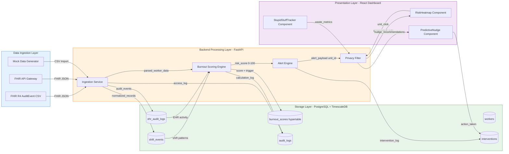

# LifeGLOW System Architecture

## Data Flow Diagram (Mermaid.js)

## Layer Descriptions

### 1. Data Ingestion Layer
- **Input**: FHIR R4 AuditEvent resources (CSV or API)
- **Components**: Mock data generator for testing, FHIR API gateway for production
- **Output**: Normalized JSON to backend processing

### 2. Backend Processing Layer (FastAPI)
- **Ingestion Service**: Validates FHIR schema, normalizes data
- **Burnout Scoring Engine**: Applies weighted algorithm (Section 4)
- **Alert Engine**: Determines risk level, generates nudges
- **Privacy Filter**: Enforces aggregation rules, threshold gating

### 3. Storage Layer (PostgreSQL + TimescaleDB)
- **Relational Tables**: workers, shift_events, ehr_audit_logs, interventions
- **Time-Series**: burnout_scores as hypertable (partitioned by week)
- **Audit Trail**: Immutable append-only audit_logs table
- **Encryption**: AES-256 column-level encryption on sensitive fields

### 4. Presentation Layer (React + Tailwind)
- **RiskHeatmap**: Unit-level grid view with color-coded risk
- **PredictiveNudge**: Actionable recommendations sorted by urgency
- **StupidStuffTracker**: Wasteful EHR action identification

## Security Boundaries
- **TLS 1.3**: All inter-layer communication encrypted
- **RBAC**: JWT tokens with role claims (Manager/Admin/Executive)
- **Data Minimization**: Only aggregated data crosses to presentation layer
- **Threshold Gate**: Individual data unlocked only when score > 85
